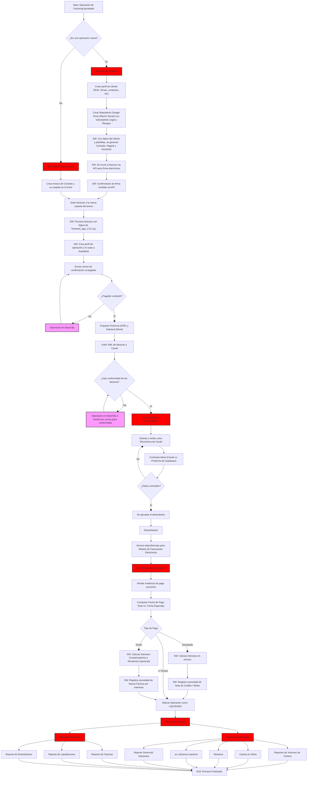

```mermaid
graph TD
    A["Start: Operación de Factoring Aprobada"] --> B{¿Es una operación nueva?};

    B --o|Sí| SW_MODULO_CLIENTES["SW: Módulo Clientes"];
    SW_MODULO_CLIENTES --> SW_PASO_1["Crear perfil de cliente (RUC, firmas, contactos, etc)"];
    SW_PASO_1 --> SW_PASO_2["Crear Repositorio Google Drive (Razón Social) con subcarpetas Legal y Riesgos"];
    SW_PASO_2 --> SW_GEN_DOCS["SW: Con datos del cliente y plantillas, se generan Contrato, Pagaré y Acuerdos"];
    SW_GEN_DOCS --> SW_SEND_KEYNUA["SW: Se envía a Keynua vía API para firma electrónica"];
    SW_SEND_KEYNUA --> SW_KEYNUA_CONFIRM["SW: Confirmación de firma recibida vía API"];
    SW_KEYNUA_CONFIRM --> K;

    B --o|No| SW_MODULO_OPERACIONES["SW: Módulo Operaciones"];
    SW_MODULO_OPERACIONES --> SW_CREAR_ANEXO["Crear Anexo de Contrato y su carpeta en G.Drive"];
    SW_CREAR_ANEXO --> K;

    K["Subir facturas a la nueva carpeta del anexo"] --> SW_PROCESAR_FACTURAS["SW: Procesa facturas con lógica de 'frontend_app_V.CLI.py'"];
    SW_PROCESAR_FACTURAS --> SW_CREAR_PERFIL_OP["SW: Crea perfil de operación y lo sube a Supabase"];
    SW_CREAR_PERFIL_OP --> L["Enviar correo de confirmación al pagador"];
    L --> M{¿Pagador contestó?};
    M --o|No| N_STANDBY["Operación en Stand-By"];
    N_STANDBY --> L;
    M --o|Sí| O["Preparar Proforma (PDF) y Solicitud (Word)"];

    O --> P["Subir XML de facturas a Cavali"];
    P --> Q{¿Hay conformidad de las facturas?};
    Q --o|No| R_STANDBY["Operación en Stand-By e Insistir por correo para conformidad"];
    R_STANDBY --> Q;

    Q --o|Sí| SW_MODULO_DESEMBOLSO["SW: Módulo de Desembolso"];
    SW_MODULO_DESEMBOLSO --> SW_GET_CAVALI["Solicita y recibe Letra Electrónica de Cavali"];
    SW_GET_CAVALI --> SW_CONTRASTE["Contrasta datos (Cavali vs. Proforma de Supabase)"];
    SW_CONTRASTE --> VERIFICACION{¿Datos coinciden?};
    VERIFICACION --o|No| SW_GET_CAVALI;
    VERIFICACION --o|Sí| SW_APROBACION["Se aprueba el desembolso"];
    SW_APROBACION --> T["Desembolsar"];
    T --> SW_FACTURACION["Genera datos/formato para Módulo de Facturación Electrónica"];

    SW_FACTURACION --> SW_MODULO_LIQUIDACION["SW: Módulo de Liquidación"];
    SW_MODULO_LIQUIDACION --> SW_RECEPCION_PAGO["Recibir evidencia de pago (voucher)"];
    SW_RECEPCION_PAGO --> SW_COMPARAR_FECHAS["Comparar Fecha de Pago Real vs. Fecha Esperada"];
    SW_COMPARAR_FECHAS --> TIPO_PAGO{Tipo de Pago};
    
    TIPO_PAGO --o|Anticipado| SW_PAGO_ANTICIPADO["SW: Calcula intereses en exceso"];
    SW_PAGO_ANTICIPADO --> SW_GEN_NC["SW: Registra necesidad de Nota de Crédito / Neteo"];
    SW_GEN_NC --> CIERRE_FINAL;

    TIPO_PAGO --o|A Tiempo| CIERRE_FINAL;

    TIPO_PAGO --o|Tardío| SW_PAGO_TARDIO["SW: Calcula Intereses Compensatorios y Moratorios (opcional)"];
    SW_PAGO_TARDIO --> SW_GEN_FACTURA["SW: Registra necesidad de Nueva Factura por intereses"];
    SW_GEN_FACTURA --> CIERRE_FINAL;

    CIERRE_FINAL["Marcar Operación como LIQUIDADA"] --> MODULO_REPORTE["Módulo de Reporte"];
    MODULO_REPORTE --> REPORTES_GERENCIALES["Reportes Gerenciales"];
    MODULO_REPORTE --> REPORTES_TRIBUTARIOS["Reportes Tributarios"];

    REPORTES_GERENCIALES --> REPORTE_VOLUMEN_CARTERA["Reportes de Volumen de Cartera"];
    REPORTES_GERENCIALES --> CARTERA_MORA["Cartera en Mora"];
    REPORTES_GERENCIALES --> RETRASOS["Retrasos"];
    REPORTES_GERENCIALES --> COBRANZA_COACTIVA["en cobranza coactivia"];
    REPORTES_GERENCIALES --> REPORTE_GERENCIAL_INTERACTIVO["Reporte Gerencial Interactivo"];

    REPORTES_TRIBUTARIOS --> REPORTE_FACTURAS["Reporte de Facturas"];
    REPORTES_TRIBUTARIOS --> REPORTE_LIQUIDACIONES["Reporte de Liquidaciones"];
    REPORTES_TRIBUTARIOS --> REPORTE_DESEMBOLSOS["Reporte de Desembolsos"];

    REPORTE_VOLUMEN_CARTERA --> Z;
    CARTERA_MORA --> Z;
    RETRASOS --> Z;
    COBRANZA_COACTIVA --> Z;
    REPORTE_GERENCIAL_INTERACTIVO --> Z;
    REPORTE_FACTURAS --> Z;
    REPORTE_LIQUIDACIONES --> Z;
    REPORTE_DESEMBOLSOS --> Z;
    Z["End: Proceso Finalizado"];

    style N_STANDBY fill:#f9f,stroke:#333,stroke-width:2px
    style R_STANDBY fill:#f9f,stroke:#333,stroke-width:2px

    style SW_MODULO_CLIENTES fill:#ff0000,stroke:#333,stroke-width:2px
    style SW_MODULO_OPERACIONES fill:#ff0000,stroke:#333,stroke-width:2px
    style SW_MODULO_DESEMBOLSO fill:#ff0000,stroke:#333,stroke-width:2px
    style SW_MODULO_LIQUIDACION fill:#ff0000,stroke:#333,stroke-width:2px
    style MODULO_REPORTE fill:#ff0000,stroke:#333,stroke-width:2px
    style REPORTES_GERENCIALES fill:#ff0000,stroke:#333,stroke-width:2px
    style REPORTES_TRIBUTARIOS fill:#ff0000,stroke:#333,stroke-width:2px
```